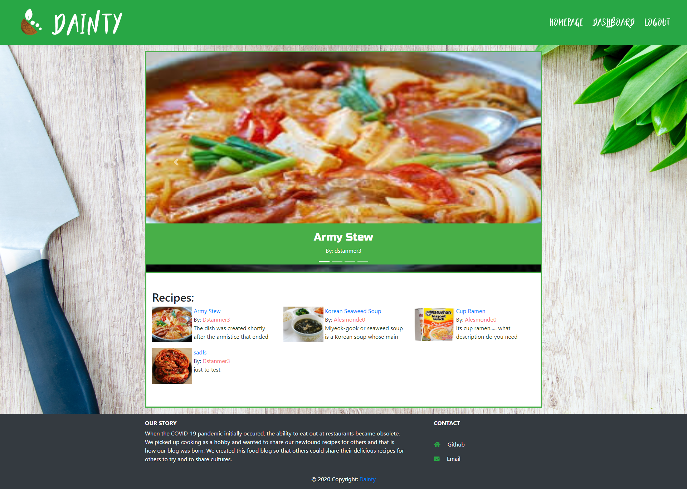
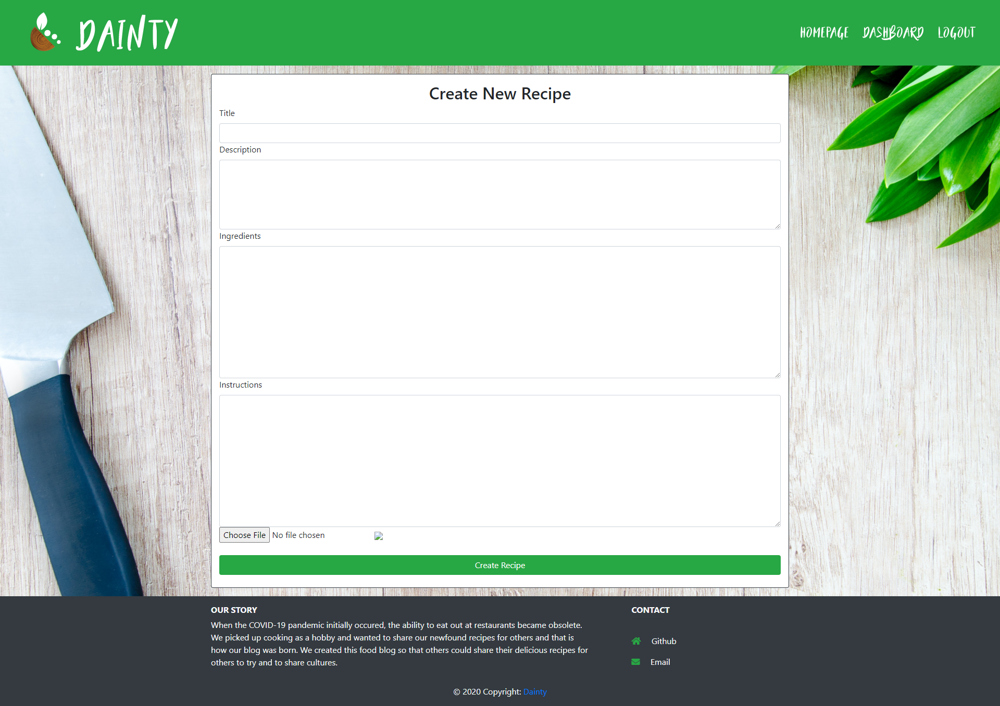
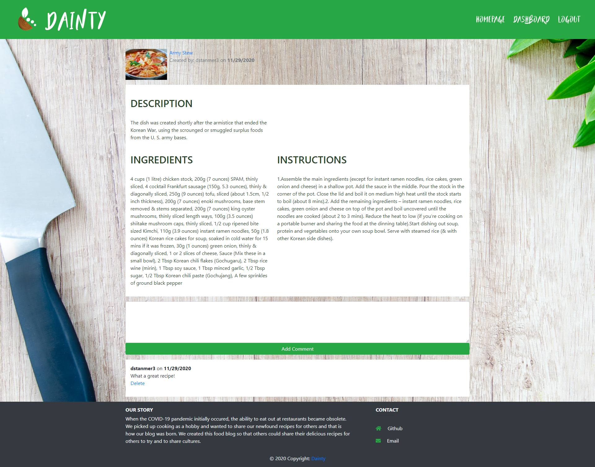

# DAINTLY

[Daintly](https://dainty-1.herokuapp.com/)

## Requirements/Description

### Description
Daintly is a newly developed food-blog designated for people who are currently looking for new recipes to expand on their own cooking repetoire. The user can access other peoples posts and designate their ideas through the comment section of the post and even add their own posts in their own dashboard. Along with their recipe they can also add in a photo to show off their newly designed recipes.

### Requirements
>AS A new person in the field of cooking
I WANT to be able to checkout other recipes so that I can learn from them and add in my own recipes as I expand my knowledge.

>GIVEN a homepage,dashboard and login/signin(logout) nav-bar

>>WHEN I click on any button in navbar prior to signing in
>> + THEN I am redirected back into login page before being able to access the dashboard and all of its features 

>>WHEN I click on the homepage button
>> + THEN I can see other peoples posts and click on their titles I am led to a single post which I can add in comments and view the recipe in full

>>WHEN I click on the dashboard button in navbar
>> + THEN I am given the option to ADD in a new recipe and see all of my former posts and the option to EDIT or even DELETE them

>>WHEN I click on the new recipes button in dashbard
>> + THEN I am given the option to CREATE a new recipe by filling out the field forms for the recipe

>>WHEN I click on the edit recipes button in dashbard
>> + THEN I am given the option to UPDATE all fields for title,ingredients, instructions, and recipe image

>>WHEN I click on comments for each post
>> + THEN I am given the option to ADD in a comment to the post

## Installation

An application that will run in the browser and is updated based on the actions of the USER and what they wish to post,edit and delete. The application features a polished UI and will be responsive to adapt to multiple screensizes. The application itself will be run through heroku cloud platform.
 
 
*Link to the DAINTLY App*  
[Daintly App](https://dainty-1.herokuapp.com/)
 
 

## Screenshot
 

## HOMEPAGE

 

## DASHBOARD

 

## NEW RECIPE FORM

 

## SINGLE POST

 

## Technologies

* [HTML5](https://developer.mozilla.org/en-US/docs/Web/Guide/HTML/HTML5)
* [CSS](https://developer.mozilla.org/en-US/docs/Web/CSS)
* [Javascript](https://developer.mozilla.org/en-US/docs/Web/JavaScript)
* [jQuery](https://jquery.com/)
* [Bootstrap](https://getbootstrap.com/)
* [SweetAlert2](https://sweetalert2.github.io/)
* [Handlebars](https://handlebarsjs.com/)
* [NodeJS](https://nodejs.org/en/)
* [Express](https://expressjs.com/)
* [Express-Sessions](https://www.npmjs.com/package/express-session)
* [Sequelize](https://sequelize.org/master/index.html)
* [MYSQL](https://www.mysql.com/)
